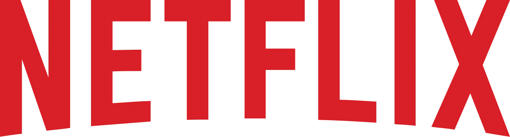

# Devflix

Este projeto é uma aplicação web fictícia chamada **Devflix**, inspirada em serviços de streaming como a Netflix. A aplicação apresenta uma interface simples com uma página de destaque de séries, sistema de carrossel e vídeos. O projeto utiliza HTML, CSS e JavaScript, além de integrar o framework Bootstrap.

## Estrutura do Projeto

Abaixo está a estrutura de pastas e arquivos do projeto:

```
├── assets/
│   ├── audios/
│   │   └── tudum-netflix-sound.mp3
│   ├── images/
│   │   ├── abyss.webp
│   │   ├── avatar.webp
│   │   ├── chokehold.webp
│   │   ├── equalizer.webp
│   │   ├── f1.webp
│   │   ├── favicon.svg
│   │   ├── hunter.webp
│   │   ├── jaula.webp
│   │   ├── lift.webp
│   │   ├── logo.webp
│   │   ├── moonfall.webp
│   └── videos/
│       ├── round6.mp4
│       └── stranger-things.mp4
├── styles/
│   └── style.css
├── index.html
```

## Funcionalidades

- **Página inicial com destaque para séries e filmes:**
  - Destaque de série com descrição e opções de "Assistir" e "Mais Informações".
  
- **Carrossel de Filmes e Séries:**
  - Apresenta os principais títulos com imagens no formato `.webp` em um sistema de carrossel responsivo.

- **Vídeo de destaque:**
  - Um vídeo de fundo da série **Stranger Things** é reproduzido automaticamente na página principal.

- **Layout Responsivo:**
  - O projeto utiliza o framework Bootstrap para garantir responsividade, além de customizações com media queries para dispositivos móveis.

## Tecnologias Utilizadas

- **HTML5**: Estrutura da página web.
- **CSS3**: Estilos e layout, incluindo customizações responsivas.
- **Bootstrap 4**: Framework para layout responsivo e componentes prontos.
- **JavaScript**: Controle de comportamento dos carrosséis.
- **Google Fonts**: Integração da fonte **Montserrat**.

## Instruções para Execução

1. Clone o repositório em sua máquina local.
2. Abra o arquivo `index.html` em um navegador para visualizar a aplicação.

## Prévia do Projeto



## Estilos Personalizados

O arquivo `style.css` inclui estilos customizados para:

- **Cores e Fontes:**
  - O fundo da página é preto (`#000`), e a fonte principal utilizada é **Montserrat**.

- **Layout:**
  - As imagens do topo e o vídeo ocupam toda a largura da página.
  - A descrição e os botões de interação ficam posicionados sobre o vídeo em telas maiores, mas são ocultados em telas menores para garantir uma experiência responsiva.

- **Carrossel:**
  - Exibe filmes e séries em um slider interativo, com imagens de 150px de altura e controles para navegação.
